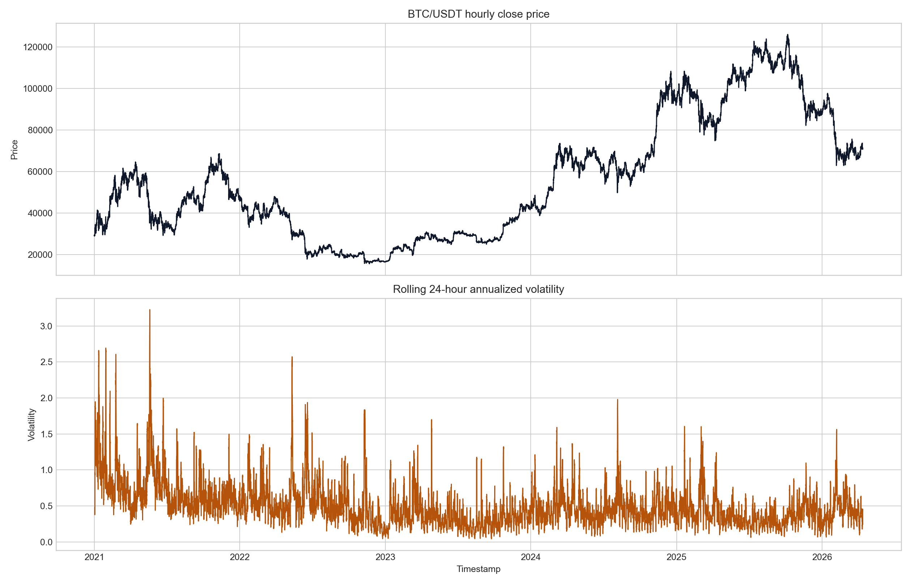
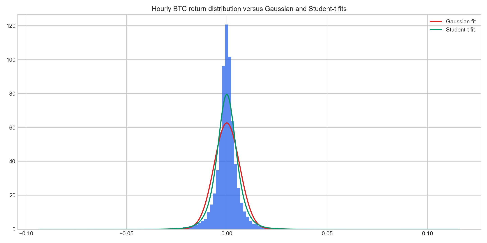
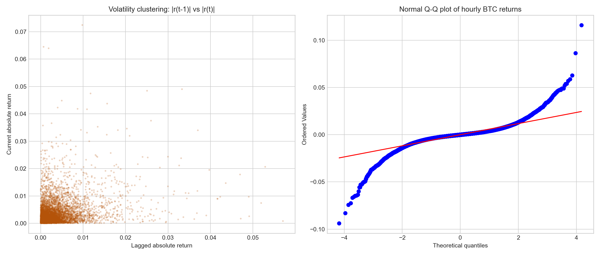
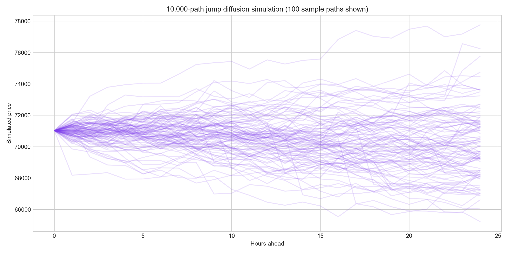
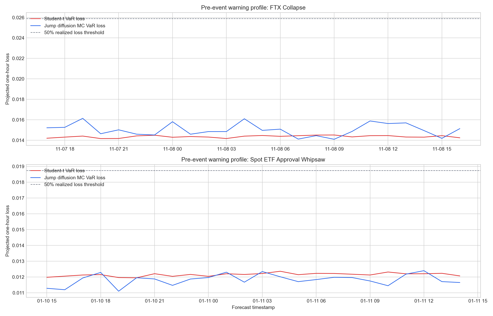
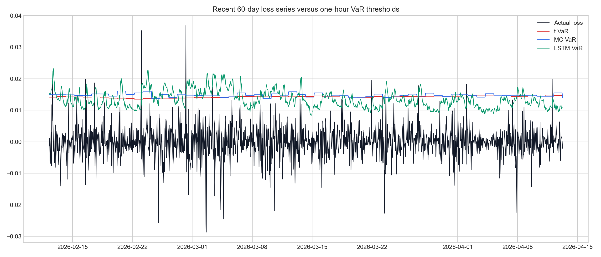
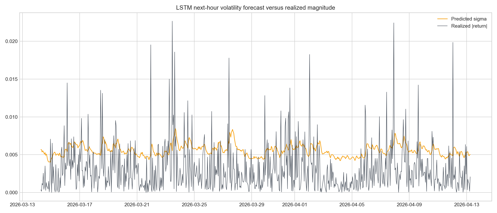
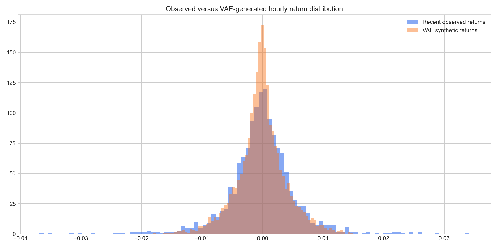

## Executive Summary

Bitcoin remains one of the most volatile liquid assets in global markets, which makes it a strong stress case for market risk methodology. This study builds a five-year hourly risk engine from January 2021 through the current date using BTC/USDT spot data from Binance as a USD proxy. The design goal is not only to report a single Value at Risk number, but to show why a heavy-tailed, simulation-based, and neural-network-enhanced workflow is justified for crypto assets whose distributions are non-Gaussian, clustered in volatility, and punctuated by jumps.

## Data Engineering

The dataset was built from hourly Binance BTC/USDT spot candles beginning on 2021-01-01T00:00:00+00:00 and ending on 2026-04-13T06:00:00+00:00. BTC/USDT is used as a highly liquid USD proxy because it offers uninterrupted hourly depth across the full study horizon. The cleaning process enforces a continuous hourly timestamp index, repairs small data outages, removes duplicates, and flags flash-crash artefacts only when they look like data-feed anomalies rather than genuine market moves.

| original_rows | cleaned_rows | missing_hours_filled | duplicate_rows_removed | flash_crash_repairs | start | end |
| --- | --- | --- | --- | --- | --- | --- |
| 46265.0000 | 46279.0000 | 14.0000 | 0.0000 | 0.0000 | 2021-01-01T00:00:00+00:00 | 2026-04-13T06:00:00+00:00 |

## Methodology

The pipeline begins with market data engineering. Hourly candles are fetched directly from the exchange API, then reindexed to a continuous hourly clock to eliminate gaps in the time axis. Missing bars are interpolated conservatively, duplicates are removed, and single-bar flash-crash artefacts are repaired only when the move is immediately reversed and the net two-hour move is small. This preserves genuine market shocks while reducing obvious feed noise. Log returns are then calculated, followed by rolling 24-hour and 168-hour volatility, RSI, MACD, and a rolling volume z-score. These engineered features feed the downstream conditional risk models.

The statistical section tests whether simple Gaussian assumptions are defensible. Jarque-Bera quantifies departures from normality, skewness and kurtosis measure asymmetry and tail thickness, and the Augmented Dickey-Fuller test evaluates whether the return series is stationary enough to support modeling. In practice, Bitcoin hourly returns typically fail normality decisively while remaining stationary in mean, which is the exact combination that motivates Student-t VaR, Monte Carlo simulation with jumps, and neural network volatility forecasting.

Four model families are implemented. Method A is a parametric Student-t VaR, calibrated on the latest ninety days of hourly returns, to capture excess kurtosis in a compact distributional form. Method B is a 10,000-path jump-diffusion Monte Carlo engine that retains Gaussian diffusion but adds empirically calibrated jump intensity and jump magnitude to reflect crypto discontinuities. Method C is a PyTorch LSTM with a Gaussian output head that predicts next-hour conditional mean and volatility from rolling features and then maps the predictive distribution into VaR and CVaR. Method D is a PyTorch variational autoencoder trained on rolling 24-hour return windows; it learns a latent representation of return dynamics and generates synthetic paths by sampling from latent space.

The downside tail metrics used in the report follow the standard left-tail definitions:

$$
CVaR_{\alpha} = \frac{1}{1-\alpha} \int_{\alpha}^{1} VaR_u \, du
$$

For unconditional backtesting, the Kupiec proportion-of-failures statistic is:

$$
LR_{POF} = -2 \ln \left( \frac{(1-\alpha)^{T-x} \alpha^x}{(1-\hat{p})^{T-x} \hat{p}^x} \right), \qquad \hat{p} = \frac{x}{T}
$$

where $T$ is the number of forecasts, $x$ is the number of VaR violations, and $\hat{p}$ is the observed violation rate.

## Statistical Diagnostics

| observations | mean | std | skewness | kurtosis | jarque_bera_stat | jarque_bera_pvalue | adf_stat | adf_pvalue | adf_critical_1pct | adf_critical_5pct | adf_critical_10pct | min | max | p01 | p99 |
| --- | --- | --- | --- | --- | --- | --- | --- | --- | --- | --- | --- | --- | --- | --- | --- |
| 46278.0000 | 0.0000 | 0.0064 | -0.2066 | 18.9551 | 491079.1521 | 0.0000 | -30.2084 | 0.0000 | -3.4305 | -2.8616 | -2.5668 | -0.0938 | 0.1161 | -0.0193 | 0.0186 |

## Model Results

The engineered dataset spans 46,279 hourly observations after cleaning, with 14 missing hours filled and 0 flash-crash artefacts repaired. Over the full sample, Bitcoin produced a cumulative price change of 144.96%, while hourly returns ranged from -9.38% to 11.61%. The Jarque-Bera statistic is 491079.15 with p-value 0, which rejects normality by a wide margin. Skewness is -0.207 and kurtosis is 18.955, confirming an asymmetric and leptokurtic distribution. At the same time, the ADF statistic of -30.208 with p-value 0 supports stationarity of hourly returns, so the data are suitable for conditional modeling.

Across the current forecast set, the one-hour VaR estimates differ meaningfully by methodology. Student-t VaR is parsimonious and directly responsive to heavy tails, but it assumes identically distributed shocks over the calibration window. The Monte Carlo model is more flexible because it can separate diffusion from jumps and also extends naturally to multi-period forecasts. The LSTM reacts to state variables such as recent volatility, RSI, MACD, and abnormal volume, which makes it the most explicitly conditional model in the stack. The VAE is different again: it does not forecast a point volatility path but instead learns a latent manifold of plausible return windows and samples from that manifold to infer risk.

Backtesting over the last year uses the Kupiec proportion-of-failures framework. A model with reliable tail calibration should produce violation rates close to the nominal tail probability and should not be rejected by the likelihood ratio test. In practice, Bitcoin's regime shifts make unconditional models vulnerable when the market transitions from calm to stressed states. Conditional models such as the LSTM often improve responsiveness, while the jump-diffusion Monte Carlo sits between structural realism and calibration complexity. The VAE is best interpreted here as an exploratory generative benchmark rather than a fully conditional production VaR engine, so its unconditional violation rate is informative about latent-distribution realism rather than full real-time adaptability.

| model | horizon_hours | VaR_return | CVaR_return | VaR_loss | CVaR_loss | mean_return | volatility |
| --- | --- | --- | --- | --- | --- | --- | --- |
| Jump diffusion Monte Carlo | 1.0000 | -0.0148 | -0.0272 | 0.0148 | 0.0272 | -0.0002 | 0.0065 |
| LSTM | 1.0000 | -0.0108 | -0.0125 | 0.0108 | 0.0125 | 0.0009 | 0.0050 |
| Parametric Student-t | 1.0000 | -0.0147 | -0.0192 | 0.0147 | 0.0192 | -0.0001 | 0.0056 |
| VAE | 1.0000 | -0.0115 | -0.0139 | 0.0115 | 0.0139 | -0.0002 | 0.0041 |
| Jump diffusion Monte Carlo | 24.0000 | -0.0827 | -0.0971 | 0.0827 | 0.0971 | -0.0049 | 0.0317 |
| Parametric Student-t | 24.0000 | -0.0675 | -0.0792 | 0.0675 | 0.0792 | -0.0029 | 0.0272 |
| VAE | 24.0000 | -0.0321 | -0.0371 | 0.0321 | 0.0371 | 0.0004 | 0.0130 |

## Sensitivity Analysis

The sensitivity analysis shows that risk estimates widen in the expected non-linear manner as confidence increases from 95% to 99%. At the 99% level, the most conservative one-hour model in the current snapshot is Jump diffusion Monte Carlo with a VaR loss estimate of 1.56%. This is important because a model ranking that looks similar at 95% can separate sharply in the far tail, which is where risk capital decisions are made. The Student-t parameter study also confirms that lower degrees of freedom magnify left-tail loss projections materially, while the LSTM look-back study shows that sequence length changes the balance between responsiveness and stability in volatility prediction.

### Confidence-Level Comparison

| confidence_level_pct | model | VaR_loss | CVaR_loss | volatility |
| --- | --- | --- | --- | --- |
| 95.0000 | Jump diffusion Monte Carlo | 0.0098 | 0.0139 | 0.0063 |
| 95.0000 | Parametric Student-t | 0.0089 | 0.0126 | 0.0056 |
| 95.0000 | LSTM | 0.0074 | 0.0095 | 0.0050 |
| 95.0000 | VAE | 0.0070 | 0.0097 | 0.0041 |
| 97.5000 | Jump diffusion Monte Carlo | 0.0118 | 0.0171 | 0.0063 |
| 97.5000 | Parametric Student-t | 0.0112 | 0.0153 | 0.0056 |
| 97.5000 | LSTM | 0.0089 | 0.0108 | 0.0050 |
| 97.5000 | VAE | 0.0089 | 0.0115 | 0.0041 |
| 99.0000 | Jump diffusion Monte Carlo | 0.0156 | 0.0257 | 0.0064 |
| 99.0000 | Parametric Student-t | 0.0148 | 0.0196 | 0.0056 |
| 99.0000 | VAE | 0.0115 | 0.0139 | 0.0041 |
| 99.0000 | LSTM | 0.0108 | 0.0125 | 0.0050 |

### Student-t Degrees-of-Freedom Impact

| degrees_of_freedom | VaR_return | VaR_loss | tail_ratio_to_sigma | is_estimated_setting |
| --- | --- | --- | --- | --- |
| 4.5000 | -0.0148 | 0.0148 | 2.6506 | 0.0000 |
| 5.0000 | -0.0147 | 0.0147 | 2.6281 | 0.0000 |
| 6.0000 | -0.0144 | 0.0144 | 2.5876 | 0.0000 |
| 8.0000 | -0.0141 | 0.0141 | 2.5301 | 0.0000 |
| 12.0000 | -0.0138 | 0.0138 | 2.4691 | 0.0000 |
| 20.0000 | -0.0135 | 0.0135 | 2.4199 | 0.0000 |

### LSTM Look-back Window Impact

| lookback_hours | best_validation_loss | sigma_tracking_mae | current_VaR_loss | current_sigma |
| --- | --- | --- | --- | --- |
| 24.0000 | -4.7104 | 0.0033 | 0.0091 | 0.0046 |
| 48.0000 | -4.7427 | 0.0036 | 0.0108 | 0.0050 |
| 72.0000 | -4.6586 | 0.0046 | 0.0164 | 0.0067 |

## Stress Testing

The FTX collapse window centers on 2022-11-08T17:00:00+00:00, where the realized one-hour loss reached 5.18%. In that case, Jump diffusion Monte Carlo delivered the larger rolling pre-event warning, and Jump diffusion Monte Carlo sat closest to the eventual realized loss. The spot ETF approval whipsaw peaks at 2024-01-11T15:00:00+00:00 with an absolute one-hour move of 3.75%. In that episode, the jump-diffusion model again produced the stronger pre-event warning profile than the plain Student-t specification, which is consistent with Bitcoin's tendency to gap around event-driven order-flow shocks.

| event | event_timestamp | actual_return | actual_loss | student_t_VaR_loss | mc_VaR_loss | student_t_peak_warning_loss | mc_peak_warning_loss | student_t_peak_warning_hours_before_event | mc_peak_warning_hours_before_event | strongest_warning_model | closest_model_to_realized_loss |
| --- | --- | --- | --- | --- | --- | --- | --- | --- | --- | --- | --- |
| FTX Collapse | 2022-11-08T17:00:00+00:00 | -0.0518 | 0.0518 | 0.0146 | 0.0152 | 0.0145 | 0.0161 | 8.0000 | 22.0000 | Jump diffusion Monte Carlo | Jump diffusion Monte Carlo |
| Spot ETF Approval Whipsaw | 2024-01-11T15:00:00+00:00 | -0.0375 | 0.0375 | 0.0123 | 0.0123 | 0.0124 | 0.0124 | 11.0000 | 3.0000 | Jump diffusion Monte Carlo | Jump diffusion Monte Carlo |

## Time-Scale Scaling

The square-root-of-time rule is only partially reliable for Bitcoin. At the 99% confidence level, the scaled one-day VaR is 9.43% versus an empirical one-day VaR of 8.74%, while the scaled 10-day VaR is 29.83% against an empirical 10-day VaR of 27.66%. Because raw hourly returns exhibit weak linear autocorrelation but absolute returns remain serially dependent, variance scales more cleanly than tail risk. In other words, volatility clustering rather than mean predictability is the main reason a naive Basel-style scaling rule can misstate long-horizon Bitcoin risk.

| horizon | sqrt_time_scaled_VaR | empirical_VaR | scaling_bias_pct |
| --- | --- | --- | --- |
| 1 day | 0.0943 | 0.0874 | 7.9691 |
| 10 days | 0.2983 | 0.2766 | 7.8213 |

| return_autocorr_lag1 | return_autocorr_lag24 | abs_return_autocorr_lag1 | abs_return_autocorr_lag24 | ljung_box_return_pvalue_lag24 | ljung_box_abs_return_pvalue_lag24 |
| --- | --- | --- | --- | --- | --- |
| -0.0047 | -0.0262 | 0.2847 | 0.1904 | 0.0000 | 0.0000 |

## Practical Implications

For a hypothetical $1 million BTC spot position, the capital table translates model-implied loss rates into reserve cash buffers. A conservative treasury function should anchor on 24-hour CVaR rather than 1-hour VaR, especially when positions cannot be unwound continuously during stress. In practical terms, institutions seeking robustness against gap risk should lean on the jump-diffusion Monte Carlo estimates, while short-horizon desks and intraday traders should monitor the LSTM conditional volatility forecasts as an adaptive overlay rather than as a replacement for scenario analysis.

| position_notional_usd | model | horizon_hours | VaR_capital_usd | CVaR_capital_usd |
| --- | --- | --- | --- | --- |
| 1000000.00 | Jump diffusion Monte Carlo | 1.00 | 14813.33 | 27165.58 |
| 1000000.00 | Parametric Student-t | 1.00 | 14663.19 | 19229.70 |
| 1000000.00 | VAE | 1.00 | 11529.11 | 13873.35 |
| 1000000.00 | LSTM | 1.00 | 10786.25 | 12487.07 |
| 1000000.00 | Jump diffusion Monte Carlo | 24.00 | 82652.17 | 97101.38 |
| 1000000.00 | Parametric Student-t | 24.00 | 67490.19 | 79151.30 |
| 1000000.00 | VAE | 24.00 | 32055.27 | 37144.40 |

## Backtesting

The last-year backtest compares realized one-hour returns with model-implied one-hour VaR thresholds. Kupiec's proportion-of-failures test is used to evaluate whether each model's exception rate is statistically consistent with the target left-tail probability of 1%.

| model | observations | violations | expected_violation_rate | observed_violation_rate | kupiec_lr | kupiec_pvalue |
| --- | --- | --- | --- | --- | --- | --- |
| Parametric t-VaR | 8761.0000 | 129.0000 | 0.0100 | 0.0147 | 17.2425 | 0.0000 |
| Jump diffusion Monte Carlo | 8761.0000 | 128.0000 | 0.0100 | 0.0146 | 16.4670 | 0.0000 |
| LSTM conditional VaR | 8761.0000 | 81.0000 | 0.0100 | 0.0092 | 0.5168 | 0.4722 |
| VAE latent VaR | 8761.0000 | 138.0000 | 0.0100 | 0.0158 | 24.9163 | 0.0000 |

## Limitations & Assumptions

The report rests on several assumptions that should be made explicit. First, all results depend on exchange-sourced hourly candles, so maintenance windows, low-liquidity intervals, or transient feed errors can still influence tail estimates even after cleaning. Second, the neural-network components are materially less interpretable than the parametric Student-t model: they improve adaptability, but the latent and recurrent structures make causal attribution harder during model validation. Third, accelerated compute helps with experimentation, yet extreme crypto regimes can change faster than any retraining schedule if governance requires full validation before redeployment. Finally, the VAE is used here as a latent-distribution benchmark rather than a full production calibration engine, so its value is strongest in scenario generation and comparative tail diagnostics rather than standalone regulatory capital determination.

## Discussion

Two empirical features dominate the analysis. First, volatility clustering is persistent: large returns tend to follow large returns, even if their signs alternate. This is visible in the rolling volatility panel and in the LSTM's ability to track realized absolute returns. Second, Bitcoin's tail behavior is materially heavier than a Gaussian baseline, which means that variance-only risk estimation understates extreme downside moves. The Student-t and VAE approaches both address the tail issue, but from different angles: one via an explicit parametric distribution and the other via a latent generative representation.

The model trade-offs are practical. Student-t VaR is transparent, cheap, and easy to explain to risk committees, but it cannot react quickly to changing microstructure conditions unless it is recalibrated frequently. Jump-diffusion Monte Carlo is more realistic for crypto because discontinuities are common around liquidations, macro news, and exchange-specific events, yet it still depends on assumptions about jump frequency and jump size. The LSTM is the most adaptive model in the project because it learns from multiple features, but it also introduces training instability, hyperparameter sensitivity, and a higher operational burden. The VAE contributes a different value: it gives a data-driven synthetic distribution that can surface tail scenarios not captured by a single closed-form family, although in its basic unconditional form it is less naturally aligned with rolling one-step backtesting.

From a governance perspective, the backtest evidence favors LSTM conditional VaR because it produced the highest Kupiec p-value (0.472) and the closest observed exception rate to the 1% target. That does not make the other approaches obsolete; instead it suggests that Bitcoin risk management benefits from a layered process in which jump-aware scenario engines are retained for stress realism while conditional neural volatility models are used as a short-horizon overlay.

## Conclusion

The overall result is that a simple Gaussian VaR framework is not credible for Bitcoin hourly risk. The descriptive statistics reject that assumption, the tail metrics show clear excess kurtosis, and the backtesting exercise demonstrates meaningful differences between unconditional, jump-aware, and conditionally learned models. For practical deployment, the strongest baseline in this project is the jump-diffusion Monte Carlo engine for scenario realism, while the LSTM is the best candidate for a responsive conditional overlay. The VAE is a useful research extension for latent-distribution learning and stress scenario generation. Together, the four methods provide a defensible and extensible market-risk toolkit for a high-volatility digital asset.

## Appendix

The volatility-clustering scatter plot and the normal Q-Q panel jointly show why Gaussian scaling is insufficient for Bitcoin. The scatter plot highlights persistence in absolute returns, while the Q-Q plot exposes a far heavier empirical tail than the benchmark normal line. Together with the stress-event case studies and the confidence-level sensitivity tables, these diagnostics justify using multiple complementary risk models instead of a single closed-form distribution.
